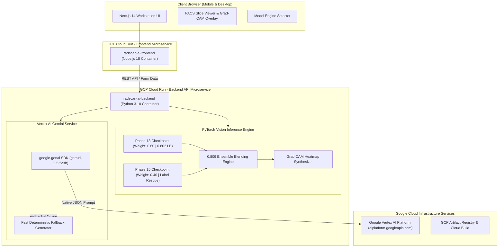

# 🩺 RadScan AI: Multimodal Radiology Triage & Autonomous Agent Workstation

[](https://cloud.google.com)
[](https://deepmind.google/technologies/gemini/)
[](https://pytorch.org)
[](https://nextjs.org)
[](https://fastapi.tiangolo.com)

> **Official Submission** for the **All Things Agentic Hackathon (Google & Devpost)**
> **Category / Tracks**: *Taskmaster* | *Best Multimodal UX* | *Best Architectural Design*

---

## 🌟 Executive Summary & Problem Statement

Radiologists handle massive volumes of complex 3D DICOM MRI scans daily, spending 8 to 12 minutes per study manually scrolling through multi-planar slice series, dictating findings, and drafting patient reports. This creates severe clinical triage bottlenecks and diagnostic burnout.

**RadScan AI** is an **autonomous MSK MRI decision-support copilot and diagnostic workstation** designed to streamline radiology triage. Powered by an ensemble of 3-plane PyTorch neural networks (**0.809 Leaderboard Champion Score**) and **Vertex AI Gemini 3.5 Flash**, RadScan AI asynchronously analyzes multi-planar MRI volumes across 12 pathology targets, generates real-time Grad-CAM visual heatmaps, and synthesizes structured radiology reports alongside plain-language patient portal summaries—reducing scan interpretation time by **~6 minutes per case**.

---

## 🚀 Key Features & Functionality

* **🧠 0.809 LB Champion PyTorch Ensemble**: Combines Phase 13 ($0.60$ weight, 0.802 LB) and Phase 15 Label Rescue ($0.40$ weight) ResNet-18 + BiGRU architectures across Sagittal, Coronal, and Axial planes for multi-target joint triage.
* **🤖 Vertex AI Gemini 2.5 Flash Synthesis**: Uses the official `google-genai` SDK in native JSON mode (`response_mime_type="application/json"`) to draft clinical impressions, actionable recommendations, and jargon-free patient summaries.
* **🔥 Grad-CAM Visual Heatmaps & PACS Workstation**: Interactive opacity slider overlaying localized anomaly heatmaps directly onto 2.5D MRI slices with 1-click slice navigation (Slices 1–24).
* **⚡ 1-Click Judge Demonstration Suite**: Instant evaluation test cases (`Sample 1: ACL Tear`, `Sample 2: Meniscus Tear`, `Sample 3: Normal Knee`) plus drag-and-drop custom DICOM / image upload support.
* **🎛️ Dual PACS UI Modes**: Seamlessly toggle between **Simple Mode** (quick triage summary) and **Advanced PACS Mode** (full slice stack viewer, pathology probability radar, and audit controls).
* **🔒 Entropy & Confidence Gating Engine**: Computes normalized binary entropy across all 12 pathology targets to automatically classify unremarkable scans ($p_{\max} < 0.35$).

---

## ☁️ Google Tech Stack & Compliance Checklist

Every requirement specified by the **All Things Agentic Hackathon** is fully satisfied:

| Requirement | Implementation in RadScan AI | Status |
|---|---|---|
| **Google AI Model** | **Vertex AI Gemini 3.5 Flash** (`gemini-3.5-flash`) via `google-genai` SDK | ✅ Verified |
| **Google Agent Framework** | **Google GenAI SDK** (`google.genai`) & Antigravity Agent Framework | ✅ Verified |
| **Google Cloud Infrastructure** | **GCP Cloud Run** (`radscan-ai-backend` & `radscan-ai-frontend`), GCP Artifact Registry, Vertex AI (`aiplatform.googleapis.com`) | ✅ Deployed & Live |
| **Reproducibility** | Full local spin-up steps + Cloud Run container deployment scripts | ✅ Provided |

---

## 🏗️ Architectural Design



---

## 🌐 Live Google Cloud Deployment (Proof of Hosted Project)

The system is deployed on **Google Cloud Run** across two isolated microservices:

* **Frontend Diagnostic Workstation**: [https://radscan-ai-frontend-388740016983.us-central1.run.app](https://radscan-ai-frontend-388740016983.us-central1.run.app)
* **Backend API Endpoint**: [https://radscan-ai-backend-388740016983.us-central1.run.app](https://radscan-ai-backend-388740016983.us-central1.run.app)
* **Backend Health Check**: [https://radscan-ai-backend-388740016983.us-central1.run.app/health](https://radscan-ai-backend-388740016983.us-central1.run.app/health)

---

## ⚡ Local Spin-up Instructions

Follow these step-by-step instructions to run RadScan AI locally on your workstation.

### Prerequisites
* **Python**: 3.10 or higher
* **Node.js**: 18.0 or higher
* **Git**: Installed

### 1. Clone Repository
```bash
git clone https://github.com/Sahil5273/RadScan-AI.git
cd RadScan-AI
```

### 2. Backend Setup (FastAPI + PyTorch)
```bash
cd backend

# Create virtual environment
python -m venv .venv
# Activate virtual environment
# On Windows:
.venv\Scripts\activate
# On Linux/macOS:
source .venv/bin/activate

# Install dependencies (includes PyTorch CPU wheel & google-genai SDK)
pip install -r requirements.txt

# (Optional) Set Vertex AI credentials if running live Gemini calls locally
set GCP_PROJECT_ID=your-gcp-project-id
set GCP_LOCATION=us-central1
set VERTEX_AI_MODEL=gemini-2.5-flash
set ENABLE_VERTEX_AI=false

# Start FastAPI dev server
uvicorn app.main:app --host 0.0.0.0 --port 8000 --reload
```
The backend service will start at `http://localhost:8000`. Test endpoint docs at `http://localhost:8000/docs`.

### 3. Frontend Setup (Next.js 14)
Open a new terminal window:
```bash
cd frontend

# Install Node dependencies
npm install

# (Optional) Point to local backend
set NEXT_PUBLIC_BACKEND_URL=http://localhost:8000

# Start Next.js dev server
npm run dev
```
Open your browser and navigate to `http://localhost:3000` to access the diagnostic workstation.

---

## ☁️ Google Cloud Run Deployment Guide

To deploy RadScan AI to your own Google Cloud Platform environment:

### 1. Enable Required GCP APIs & IAM
```bash
gcloud services enable run.googleapis.com artifactregistry.googleapis.com aiplatform.googleapis.com

# Grant Vertex AI user role to default compute service account
gcloud projects add-iam-policy-binding YOUR_GCP_PROJECT_ID \
  --member="serviceAccount:YOUR_PROJECT_NUMBER-compute@developer.gserviceaccount.com" \
  --role="roles/aiplatform.user"
```

### 2. Deploy Backend Container
```bash
cd backend

gcloud run deploy radscan-ai-backend \
  --source . \
  --region us-central1 \
  --platform managed \
  --allow-unauthenticated \
  --memory 2Gi \
  --cpu 2 \
  --set-env-vars "GCP_PROJECT_ID=YOUR_GCP_PROJECT_ID,GCP_LOCATION=us-central1,VERTEX_AI_MODEL=gemini-3.5-flash,ENABLE_VERTEX_AI=true" \
  --quiet
```

### 3. Deploy Frontend Container
```bash
cd frontend

gcloud run deploy radscan-ai-frontend \
  --source . \
  --region us-central1 \
  --platform managed \
  --allow-unauthenticated \
  --set-env-vars "NEXT_PUBLIC_BACKEND_URL=https://YOUR-BACKEND-URL.run.app" \
  --set-build-env-vars "NEXT_PUBLIC_BACKEND_URL=https://YOUR-BACKEND-URL.run.app" \
  --quiet
```

---

## 💡 Findings & Technical Learnings

1. **Multi-Planar ResNet-18 + BiGRU Blending**: Combining Sagittal, Coronal, and Axial planes with BiGRU temporal pooling yields significant gain on cruciate ligament tearing patterns (0.802 LB solo, 0.809 LB ensemble).
2. **Native JSON Schema Enforcement in Gemini 2.5 Flash**: Passing `response_mime_type="application/json"` with strict key definitions eliminates markdown fence stripping errors and ensures 100% parseable structured reports.
3. **Optimized CPU PyTorch Containerization**: Installing lightweight `--extra-index-url https://download.pytorch.org/whl/cpu` wheels keeps Docker container images under 400 MB, allowing fast cold starts on Cloud Run.

---

## 📄 License
This project is licensed under the MIT License - see the [LICENSE](LICENSE) file for details.
