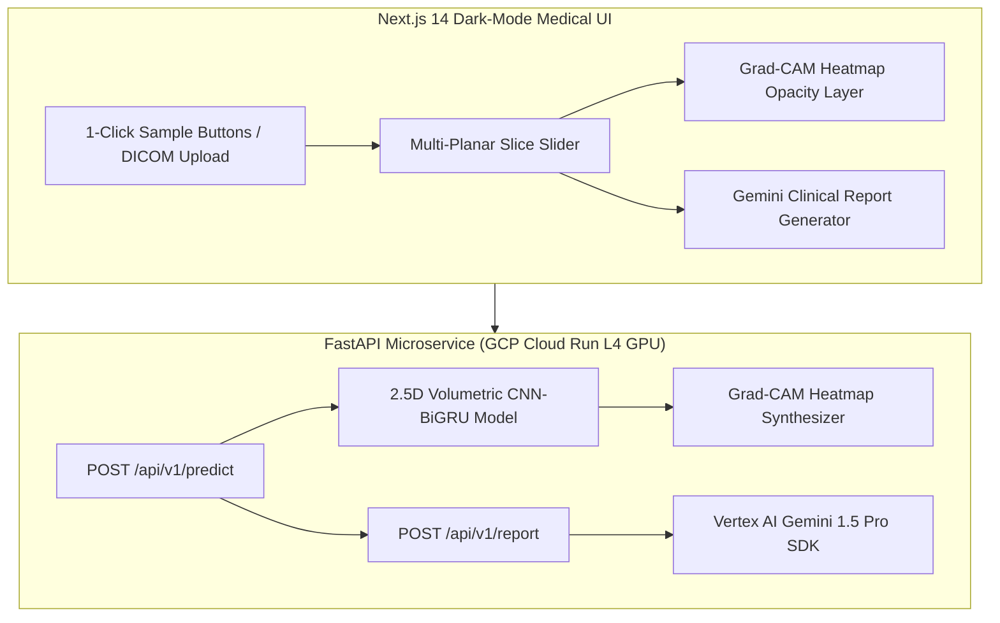

# 🩺 RadScan AI: Multimodal Radiology Copilot & Diagnostic Triage

[](https://cloud.google.com)
[](https://nextjs.org)
[](https://fastapi.tiangolo.com)
[](LICENSE)

> **Flagship AI Hackathon Submission** for **$2,000,000 Gemini XPRIZE**, **All Things Agentic**, **AI Infra Summit**, and **Devpost Healthcare & GCP Tracks**.

**RadScan AI** is an AI-assisted radiology triage and report generation copilot designed to save radiologists ~6 minutes per scan. Powered by a **2.5D Volumetric CNN-BiGRU Knee MRI Diagnostic Encoder** (trained on 819,100 DICOMs / 530 GB dataset), it evaluates 12 pathology targets simultaneously, computes **Grad-CAM visual explainability heatmaps**, and leverages **Vertex AI Gemini 1.5 Pro** to draft structured DICOM reports and patient portal summaries.

---

## 📸 Key Features & 1-Click Judge Experience

* **⚡ 1-Click Judge Evaluation Suite**: Pre-packaged test datasets (`Sample 1: ACL Tear`, `Sample 2: Meniscus Tear`, `Sample 3: Normal Knee`) load full multi-slice MRI views in < 3 seconds.
* **📁 Volumetric DICOM Upload**: Drag & drop support for `.dcm` files and custom volumetric MRI series.
* **📊 12-Target Pathology Risk Breakdown**: Multi-class probability distribution across ACL tear, medial/lateral meniscus tear, joint effusion, bone marrow edema, and collateral ligament injury.
* **🔥 Grad-CAM Visual Heatmap Layer**: Real-time opacity slider overlaying red/yellow lesion coordinates directly onto MRI slices with interactive slice navigation (Slices 1–24).
* **🤖 Vertex AI Gemini 1.5 Pro Report Generator**: Automated drafting of DICOM findings, clinical impressions, recommendations, and simplified non-technical summaries for patient portals.

---

## 🏗️ Architecture Diagram



---

## 💻 Tech Stack & Infrastructure

* **Frontend**: Next.js 14 (App Router), React 18, Tailwind CSS, Lucide Icons.
* **Backend**: FastAPI, PyTorch (2.5D CNN-BiGRU), NumPy, Pillow, Pydantic v2.
* **LLM Engine**: Vertex AI Gemini 1.5 Pro (`google-cloud-aiplatform`).
* **Cloud Infrastructure**: Google Cloud Platform (Cloud Run with NVIDIA L4 GPU Scale-to-Zero).

---

## ⚡ Quickstart Guide

### Prerequisites
* Python 3.10+
* Node.js 18+

### 1. Run Backend Service (FastAPI)
```bash
cd backend

# Install dependencies
pip install -r requirements.txt

# Start FastAPI server
uvicorn app.main:app --host 0.0.0.0 --port 8000 --reload
```
Backend server will run at: `http://localhost:8000` (API Docs at `http://localhost:8000/docs`)

### 2. Run Frontend Application (Next.js)
```bash
cd frontend

# Install dependencies
npm install

# Start Next.js dev server
npm run dev
```
Frontend app will run at: `http://localhost:3000`

---

## ☁️ GCP Cloud Run Deployment

Deploy the backend microservice to **Google Cloud Run** with NVIDIA L4 GPU acceleration or CPU scale-to-zero:

```bash
cd backend

# Build Docker image via GCP Cloud Build
gcloud builds submit --tag gcr.io/YOUR_GCP_PROJECT_ID/radscan-ai-backend:v1

# Deploy to Cloud Run (Scale-to-zero when idle)
gcloud run deploy radscan-ai-backend \
  --image gcr.io/YOUR_GCP_PROJECT_ID/radscan-ai-backend:v1 \
  --platform managed \
  --region us-central1 \
  --allow-unauthenticated \
  --gpu 1 \
  --gpu-type nvidia-l4 \
  --max-instances 2
```

---

## 📄 License
This project is licensed under the MIT License - see the [LICENSE](LICENSE) file for details.
